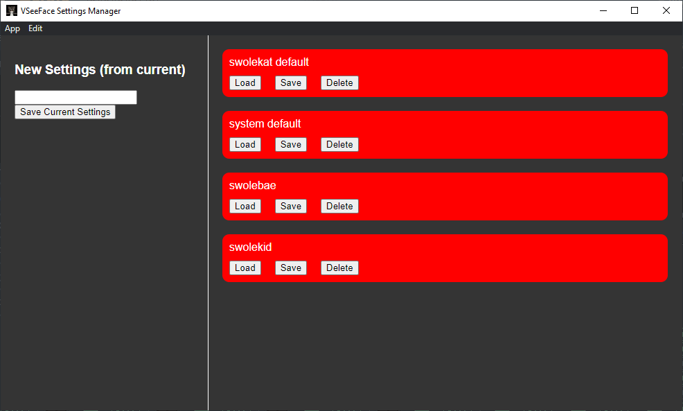

# vseeface-settings-switcher
app to change vseeface settings for multiple avatars

## How to install

Go to [the releases page](https://github.com/swolekat/vseeface-settings-switcher/releases) and find the latest release. Download the .exe file and run it. The app will be installed. You won't have any settings initially but you can create them pretty easily using the UI. Would strongly recommend backing up your existing settings (located in `%APPDATA%\..\LocalLow\Emiliana_vt\VSeeFace`) before using!

## Instructions

### How to save
To save whatever is in the current `settings.ini` file to a named setting, you need to fill out the name input and click on current settings (both on the left).

### How to load
Click the load button on the right. This will replace whatever is in the current `settings.ini` file with what you have saved. VSeeFace loads in the settings from the file when you click `Start` so you should load before you click that button.

### Updating saved settings
To save whatever is in the current `settings.ini` file to a named settings, click the `save` button on the named setting card.

## Support
This project is free for anyone to use and update. If you need to contact me specifically, stop by my stream at http://twitch.tv/swolekat or leave an issue on github. 